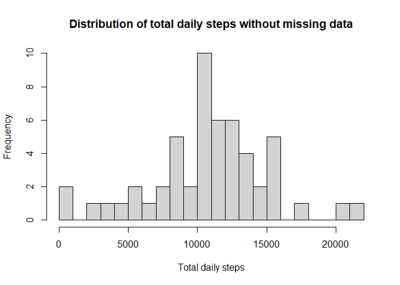
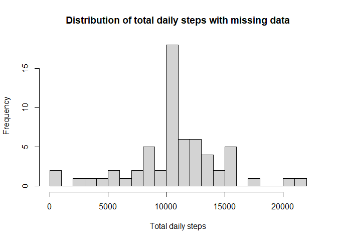

## Introduction

It is now possible to collect a large amount of data about personal movement 
using activity monitoring devices such as a Fitbit, Nike Fuelband, or 
Jawbone Up. These type of devices are part of the “quantified self” movement – a group of enthusiasts who take measurements about themselves regularly to improve their health, to find patterns in their behavior, or because they are tech 
geeks. But these data remain under-utilized both because the raw data are hard 
to obtain and there is a lack of statistical methods and software for 
processing and interpreting the data.

This assignment makes use of data from a personal activity monitoring 
device. This device collects data at 5 minute intervals through out the day.
The data consists of two months of data from an anonymous individual collected 
during the months of October and November, 2012 and include the number of steps 
taken in 5 minute intervals each day.

The data for this assignment can be downloaded from the course web site:

Dataset: [Activity monitoring data](https://d396qusza40orc.cloudfront.net/repdata%2Fdata%2Factivity.zip) [52K]

The variables included in this dataset are:

- steps: Number of steps taking in a 5-minute interval (missing values are coded 
as \color{red}{\verb|NA|}NA)
- date: The date on which the measurement was taken in YYYY-MM-DD format
- interval: Identifier for the 5-minute interval in which measurement was taken

The dataset is stored in a comma-separated-value (CSV) file and there are a 
total of 17,568 observations in this dataset.


## Loading and preprocessing the data

1. Load the data (i.e. \color{red}{\verb|read.csv()|}read.csv().


```r
library(ggplot2)
raw_data <- read.csv("./data/activity.csv")
```

2. Process/transform the data (if necessary) into a format suitable for your 
analysis.


```r
raw_data$date <- as.Date(raw_data$date)
data <- subset(raw_data, !is.na(raw_data$steps))
```

## What is mean total number of steps taken per day?

1. Calculate the total number of steps taken per day.


```r
daily_steps <- tapply(data$steps, data$date, sum, simplify=TRUE)
head(daily_steps)
```

```
## 2012-10-02 2012-10-03 2012-10-04 2012-10-05 2012-10-06 2012-10-07 
##        126      11352      12116      13294      15420      11015
```

2. Make a histogram of the total number of steps taken each day.


```r
hist(x=daily_steps, xlab="Total daily steps", ylab="Frequency", breaks=20,
     main="Distribution of total daily steps without missing data")
```

<!-- -->

3. Calculate and report the mean and median of the total number of steps 
taken per day.


```r
mean(daily_steps)
```

```
## [1] 10766.19
```

```r
median(daily_steps)
```

```
## [1] 10765
```

## What is the average daily activity pattern?

1. Make a time series plot (i.e. \color{red}{\verb|type = "l"|}type = "l") 
of the 5-minute interval (x-axis) and the average number of steps taken, 
averaged across all days (y-axis).


```r
avg_int <- tapply(data$steps, data$interval, mean, simplify=T)
df_avgint <- data.frame(interval=as.integer(names(avg_int)), avg=avg_int)

with(df_avgint, plot(interval, avg, xlab="5-minute interval", 
                     ylab="Average number of steps", type="l"))
```

<!-- -->

2. Which 5-minute interval, on average across all the days in the dataset, 
contains the maximum number of steps?


```r
df_avgint[df_avgint$avg == max(avg_int), ]
```

```
##     interval      avg
## 835      835 206.1698
```

## Imputing missing values

1. Calculate and report the total number of missing values in the dataset 
(i.e. the total number of rows with \color{red}{\verb|NA|}NAs).


```r
sum(is.na(raw_data))
```

```
## [1] 2304
```

2. Devise a strategy for filling in all of the missing values in the dataset. 
The strategy does not need to be sophisticated. For example, you could use the mean/median for that day, or the mean for that 5-minute interval, etc. 

        Here, the mean for the 5-minute interval where there's missing data is taken.

3. Create a new dataset that is equal to the original dataset but with the 
missing data filled in.


```r
na_data <- raw_data
logic_na <- is.na(na_data$steps)
avg_int <- tapply(data$steps, data$interval, mean, simplify=T)
na_data$steps[logic_na] <- avg_int[as.character(na_data$interval[logic_na])]
```

4. Make a histogram of the total number of steps taken each day and Calculate 
and report the mean and median total number of steps taken per day. Do these
values differ from the estimates from the first part of the assignment? What 
is the impact of imputing missing data on the estimates of the total daily
number of steps?


```r
new_dailysteps <- tapply(na_data$steps, na_data$date, sum, simplify=T)

hist(x=new_dailysteps, xlab="Total daily steps", ylab="Frequency", breaks=20,
     main="Distribution of total daily steps with missing data")
```

<!-- -->

```r
mean(new_dailysteps)
```

```
## [1] 10766.19
```

```r
median(new_dailysteps)
```

```
## [1] 10766.19
```

        We see the same value as before for the mean, but different values for
        the median, which now is the same as the mean. A possible explanation
        considers the strategy chosen for imputing: using the 5-minute interval
        means makes the median closer to the mean. Also, we see that now 
        a higher frequency can be seen in the middle region of the plot. 

## Are there differences in activity patterns between weekdays and weekends?

First, the language is set to English to avoid problems with the days' names.


```r
Sys.setlocale("LC_ALL","English")
```

```
## [1] "LC_COLLATE=English_United States.1252;LC_CTYPE=English_United States.1252;LC_MONETARY=English_United States.1252;LC_NUMERIC=C;LC_TIME=English_United States.1252"
```

Then, a function is created to determine whether a day is a weekday or part of 
the weekend and the day's classification is added to the dataset.

 
 ```r
 is.weekday <- function(d) {
    wd <- weekdays(d)
    ifelse (wd == "Saturday" | wd == "Sunday", "weekend", "weekday")
 }
 
 wd_wk <- sapply(na_data$date, is.weekday)
 na_data$wd_wk <- as.factor(wd_wk)
 head(na_data)
 ```
 
 ```
 ##       steps       date interval   wd_wk
 ## 1 1.7169811 2012-10-01        0 weekday
 ## 2 0.3396226 2012-10-01        5 weekday
 ## 3 0.1320755 2012-10-01       10 weekday
 ## 4 0.1509434 2012-10-01       15 weekday
 ## 5 0.0754717 2012-10-01       20 weekday
 ## 6 2.0943396 2012-10-01       25 weekday
 ```

2. Make a panel plot containing a time series plot (i.e. \color{red}{\verb|type 
= "l"|}type = "l") of the 5-minute interval (x-axis) and the average number of 
steps taken, averaged across all weekday days or weekend days (y-axis). See the README file in the GitHub repository to see an example of what this plot should 
look like using simulated data.


```r
week_df <- aggregate(steps ~ wd_wk+interval, data=na_data, FUN=mean)

library(lattice)

xyplot(steps ~ interval | factor(wd_wk), layout = c(1, 2), xlab="Interval",
       ylab="Number of steps", type="l", data=week_df)
```

<!-- -->
